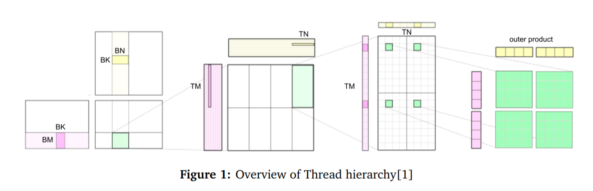
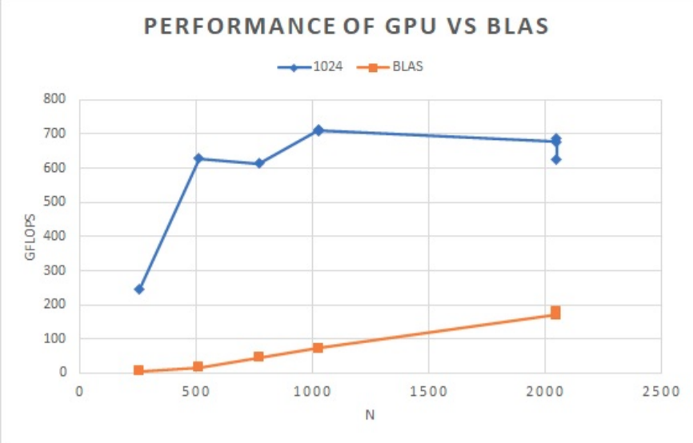
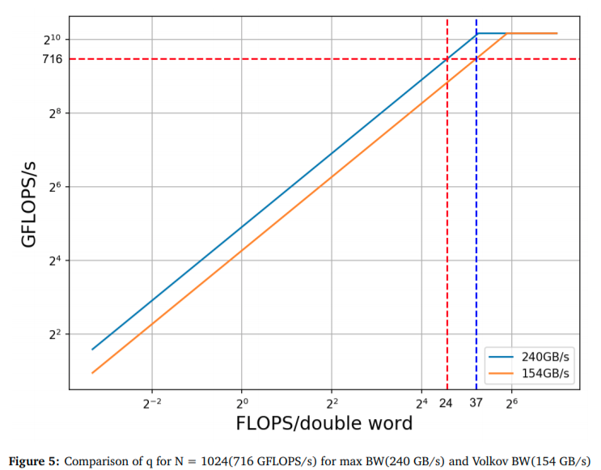

# OPTIMISING MATRIX MULTIPLY WITH A CUDA KERNEL

Description
===========
In this project, we use our knowledge of the thread hierarchy and mapping to optimize a matrix multiply routine. We compare it with the naive routine and BLAS, which is an optimized CPU based linear algebra subroutine. We optimize our code for maximum performance on one GPU of an Amazon EC2 p2.xlarge instance and report our results as obtained on
Sorken cluster with 2 GK210 GPUs. 

Code organization
=================
* mmpy_kernel.cu - implements CUDA kernel
* mmpy.cu - performs matrix multiply over GPU. Use makefile to compile.

Results
=======

Acknowledgements
================
I thank Prof. Bryan Chin and TAs for their guidance and support.

